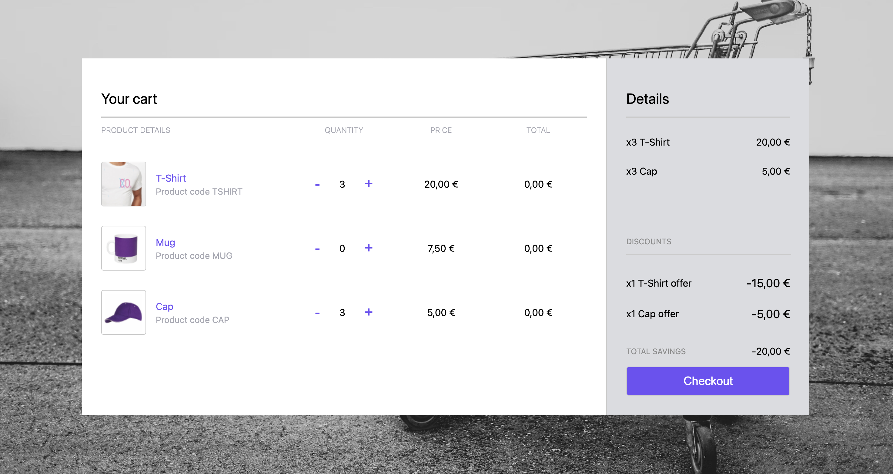

# Shopping Cart Application with Svelte + TypeScript + Vite

This is a robust shopping cart application developed using Svelte, TypeScript, and Vite. The application provides a seamless shopping experience, allowing users to add items to a shopping cart, apply discounts, and proceed to checkout.


## Screenshots




## Key Features

- **Add Items to Cart**: Users can add items to the shopping cart with ease.
- **Discount Application**: The application supports automatic application of discounts based on predefined rules.
- **Checkout Functionality**: Users can proceed to checkout, with the application calculating the total cost after discounts.

## Stack

This was my first application built with Svelte, TypeScript, and Vite. It uses Svelte stores for state management and Vite for building and serving the application. The application also uses Vitest for testing.
## Codebase Structure

The codebase is organized into several key directories:

- `src`: Contains the main application code, including Svelte components and the shopping cart store.
- `tests`: Contains unit and functional tests for the application.
- `src/config`: Contains JSON files for products and discounts.

## Modifying Products and Discounts

Products and discounts can be easily modified by editing the corresponding JSON files in the `assets` directory:

- `products.json`: Defines the available products. Each product has a `code`, `name`, and `price`.
- `discounts.json`: Defines the discount rules. Each rule has a `type` and parameters specific to the type.

For example, to add a new product, you would add a new object to the `products.json` file:

```json
{
  "code": "NEWPROD",
  "name": "New Product",
  "price": 500
}
```

To add a new discount rule, you would add a new property to the `discounts.json` file:

```json
{
  "NEWPROD": {
    "type": "bulkDiscount",
    "requiredQuantity": 2,
    "discountPercentage": 50
  }
}
```

This rule would apply a 50% discount to the "New Product" when two or more are added to the cart.

## Running the Application

To run the application, follow these steps:

1. Clone the repository: `git clone https://github.com/your-repo/shopping-cart.git`
2. Navigate to the project directory: `cd shopping-cart`
3. Install the dependencies: `npm install`
4. Start the development server: `npm run dev`

The application will be available at `http://localhost:5000`.

To run the tests, use the following command: `npm run test`

## Discounts

The application supports the following discount rules:

- **CAP**: Buy 3, get 1 free. When a user adds four "CAP" items to the cart, the price of one is deducted.
- **TSHIRT**: Bulk discount. When a user buys three or more "TSHIRT" items, a 25% discount is applied to all "TSHIRT" items.

These rules are applied automatically when the relevant items are added to the cart. The application calculates the total cost after discounts during checkout.


## Extending Discounts

The application currently supports two types of discounts: "buy X get Y free" and "bulk discount". These are defined in the `DiscountType` enum in `src/stores/cart.ts`:

```ts
enum DiscountType {
  BUY_X_GET_Y_FREE = 'buyXGetYFree',
  BULK_DISCOUNT = 'bulkDiscount',
};
```

The logic for applying these discounts is implemented in the `calculateTotal` function in the same file:

```ts
if (discountConfig) {
  switch (discountConfig.type) {
    case DiscountType.BUY_X_GET_Y_FREE:
      if (item.quantity >= discountConfig.requiredQuantity) {
        const freeItems = Math.floor(item.quantity / discountConfig.requiredQuantity) * discountConfig.freeQuantity;
        discount = freeItems * item.price;
      }
      break;
    case DiscountType.BULK_DISCOUNT:
      if (item.quantity >= discountConfig.requiredQuantity) {
        discount = total * (discountConfig.discountPercentage / 100);
      }
      break;
    default:
      break;
  }
}
```
If you want to add more types of discounts, you can do so by extending the `DiscountType` enum and adding the corresponding logic in the `calculateTotal` function. For example, to add a "percentage off" discount, you could do the following:

1. Add a new type to the `DiscountType` enum:

```ts
enum DiscountType {
  BUY_X_GET_Y_FREE = 'buyXGetYFree',
  BULK_DISCOUNT = 'bulkDiscount',
  PERCENTAGE_OFF = 'percentageOff',
};
```

2. Add the corresponding logic in the `calculateTotal` function:

```ts
case DiscountType.PERCENTAGE_OFF:
  discount = total * (discountConfig.discountPercentage / 100);
  break;
```

3. Add the new discount rule to the `discounts.json` file:

```json
{
  "NEWPROD": {
    "type": "percentageOff",
    "discountPercentage": 20
  }
}
```

This rule would apply a 20% discount to the "New Product".


## Docker

You can also run this application using Docker. First, build the Docker image:

```bash
npm run docker:build
```

This will create a Docker image named `shopping-cart-discounts-app`.

Then, you can run the application:

```bash
npm run docker:run
```

This will start the application and make it available at `http://localhost:8080`.


* Please note that Docker needs to be installed and running on your machine to build and run the Docker image.
